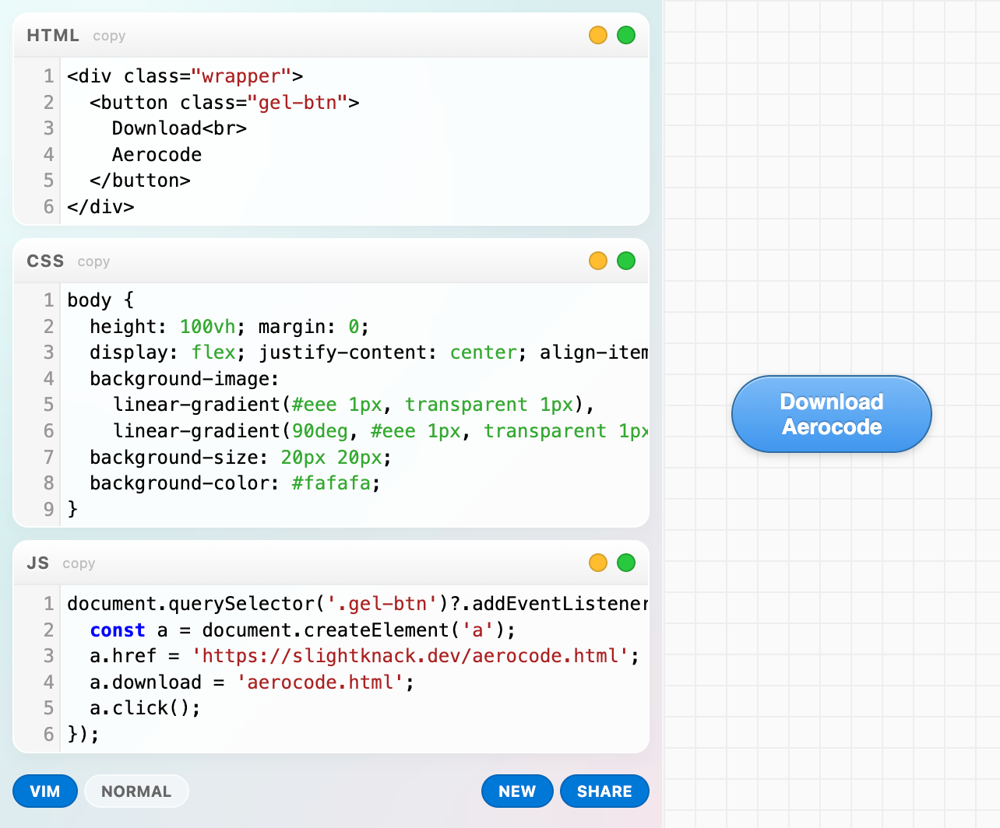
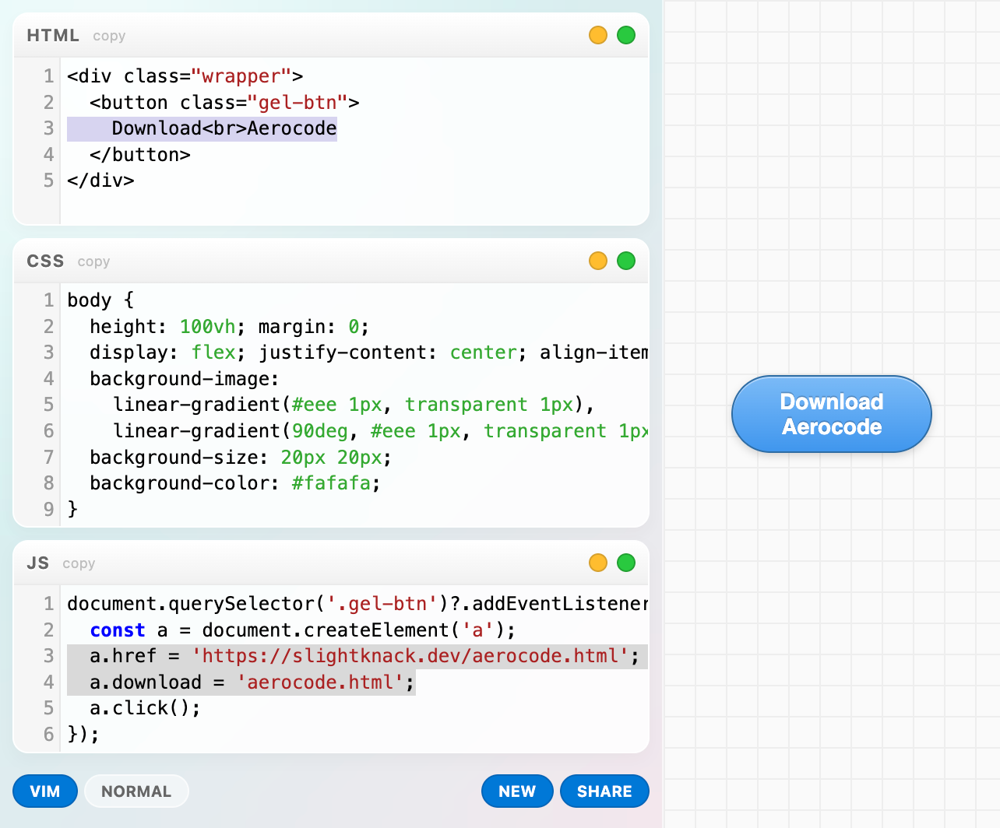
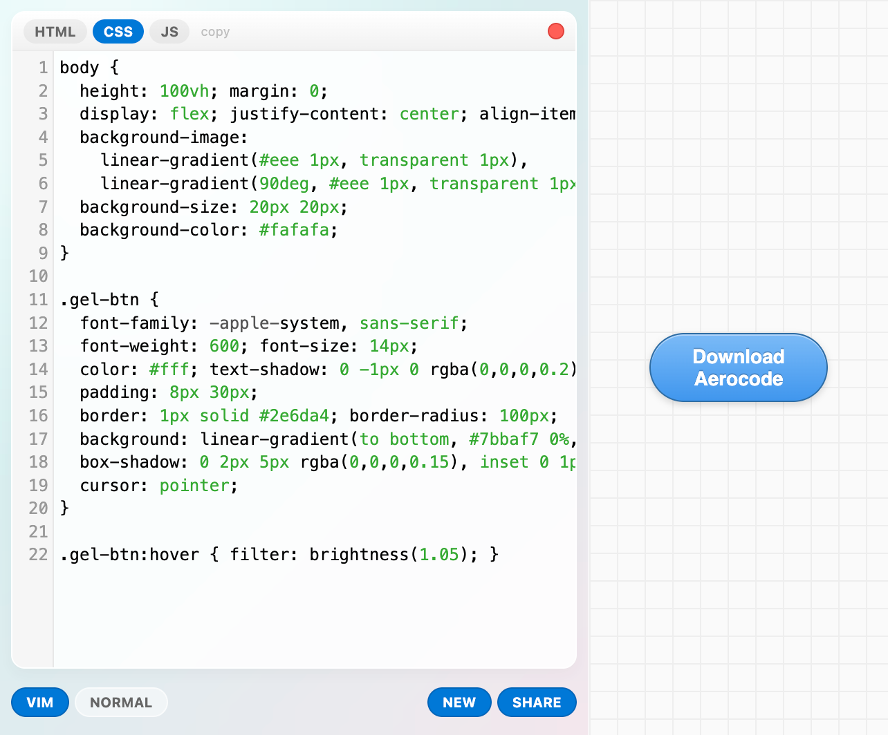
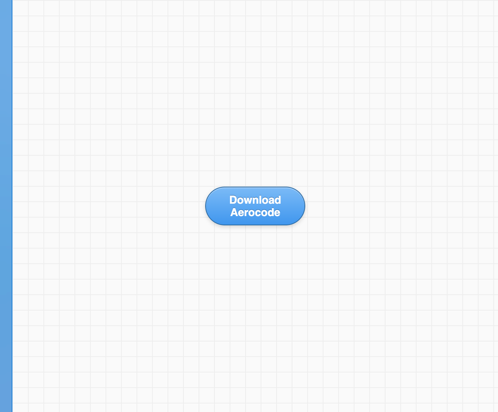

# AeroCode

CodePen with Frutiger Aero aesthetic. Single HTML file, no build step. One-day project, took < 6h start to finish.

**Live demo: [isaac.sh/aerocode](https://slightknack.dev/aerocode.html
)**

<table>
<tr>
<td></td>
<td></td>
</tr>
<tr>
<td></td>
<td></td>
</tr>
</table>

## Features

- Three editor panels (HTML, CSS, JS) with live preview
- Vim and normal editing modes
- Resizable and collapsible panels
- Fullscreen mode for any panel
- State persisted in URL for sharing
- Works offline once loaded

## Usage

Open aerocode.html in a browser. Edit code on the left, see results on the right.

- Drag panel headers to resize
- Click yellow button to collapse/expand
- Click green button for fullscreen
- Click SHARE to copy URL with your code
- Click NEW to start fresh

## Dependencies

CodeMirror 5.65.13 (loaded from CDN)

## License

CC0 1.0 Universal - Public Domain

> "`</script>` in a JavaScript comment still terminates the script tag for the HTML parser."
