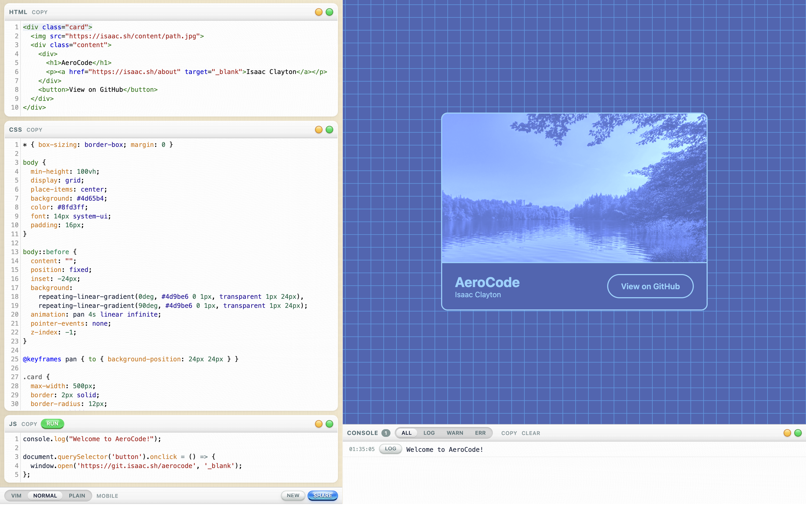

# AeroCode

CodePen with Frutiger Aero aesthetic. Single HTML file, no build step.

**Live demo: [isaac.sh/aerocode](https://slightknack.dev/aerocode.html)**

## Features

- Three editor panels (HTML, CSS, JS) with live preview
- HTML and CSS update live; JS runs on demand via RUN button or Cmd+Enter
- Vim, normal, and plain editing modes
- Resizable and collapsible panels with fullscreen mode
- Console with log/warn/error filtering and click-to-jump-to-line
- Infinite loop protection (iframe runs in a separate process)
- State persisted in URL for sharing
- Works offline once loaded

## Usage

Open aerocode.html in a browser. Edit code on the left, see results on the right.

- Drag panel headers to resize
- Click yellow button to collapse/expand
- Click green button for fullscreen
- Click RUN or press Cmd+Enter to execute JS
- Click SHARE to copy URL with your code
- Click NEW to start fresh

## Dependencies

CodeMirror 5.65.13 (loaded from CDN)

## License

CC0 1.0 Universal - Public Domain

> "`</script>` in a JavaScript comment still terminates the script tag for the HTML parser."
